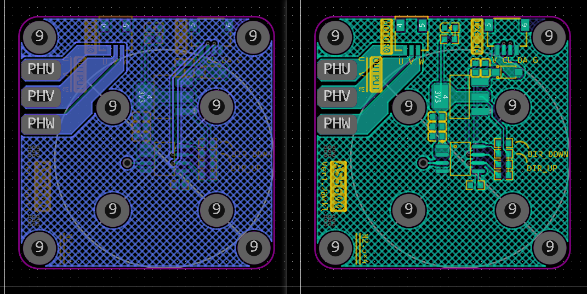
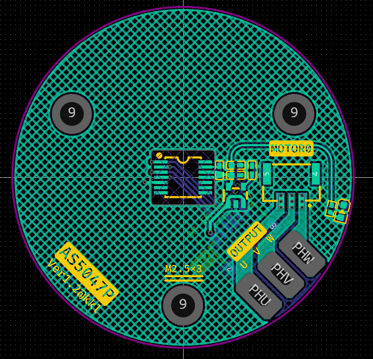

### EasyFOC的PCB工程 / 嘉立创EDA

> 超迷你的FOC矢量控制器EasyFOC.

- `EasyFOC.epro` -> EasyFOC的PCB工程原文件
- `AS5047P磁编码器板.epro` -> 磁编码器AS5047P的PCB工程原文件
- `AS5600磁编码器板.epro` -> 磁编码器AS5600的PCB工程原文件
- `Gerber_EasyFOC_Ver1.1.zip` -> PCB的Gerber打板文件

### Snapshot

