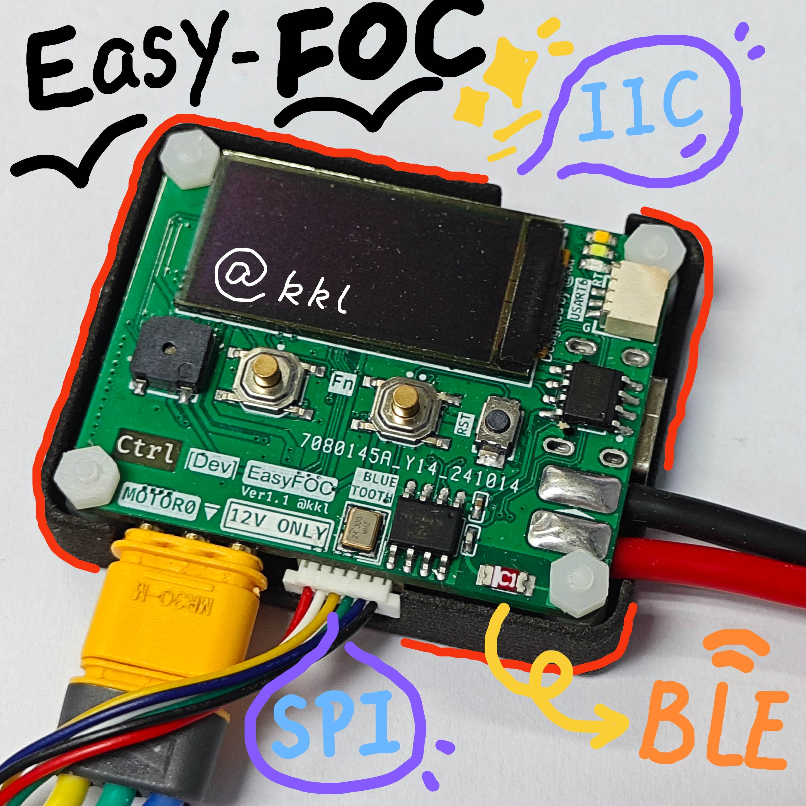
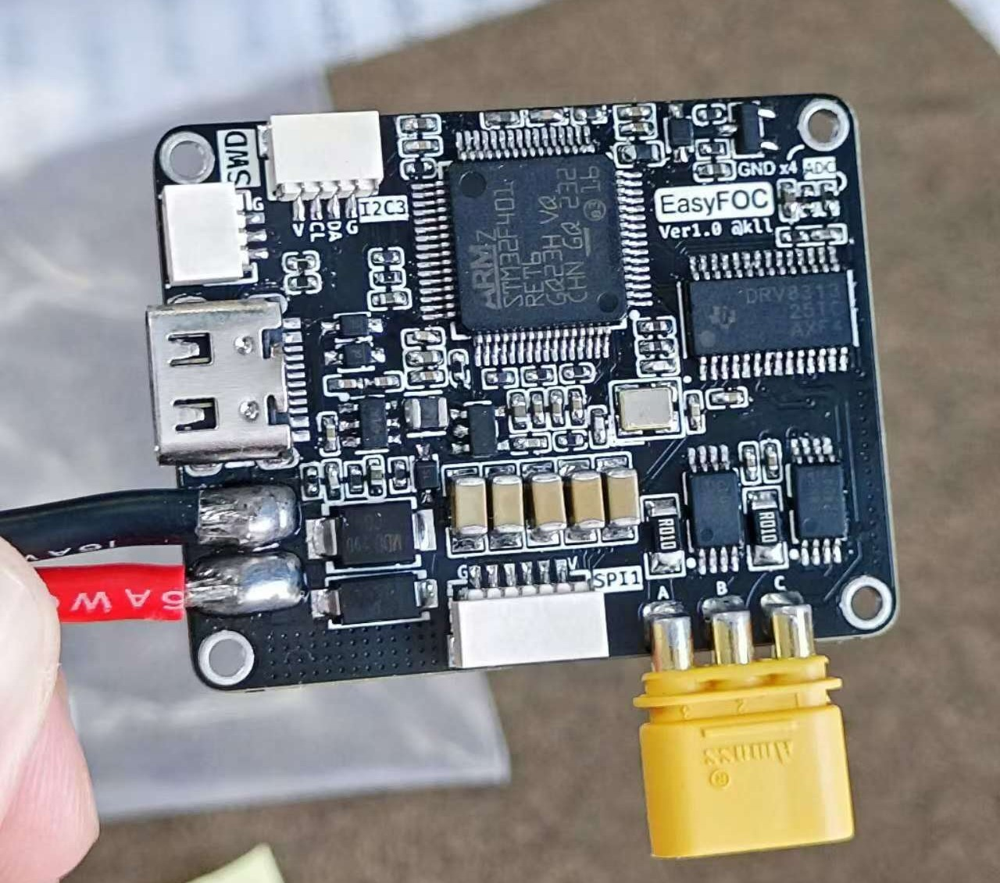
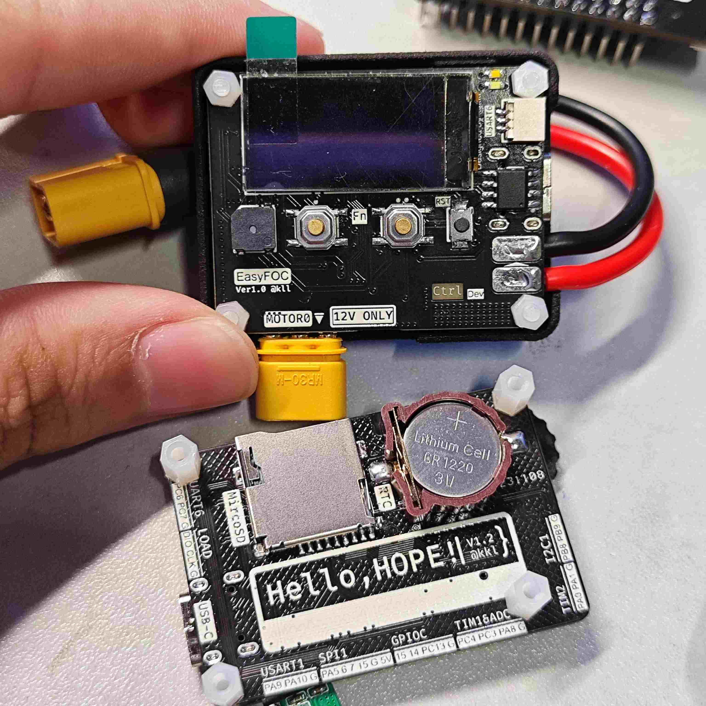
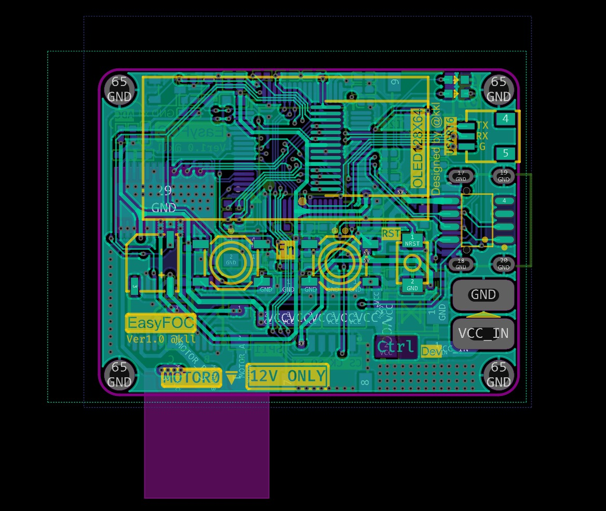
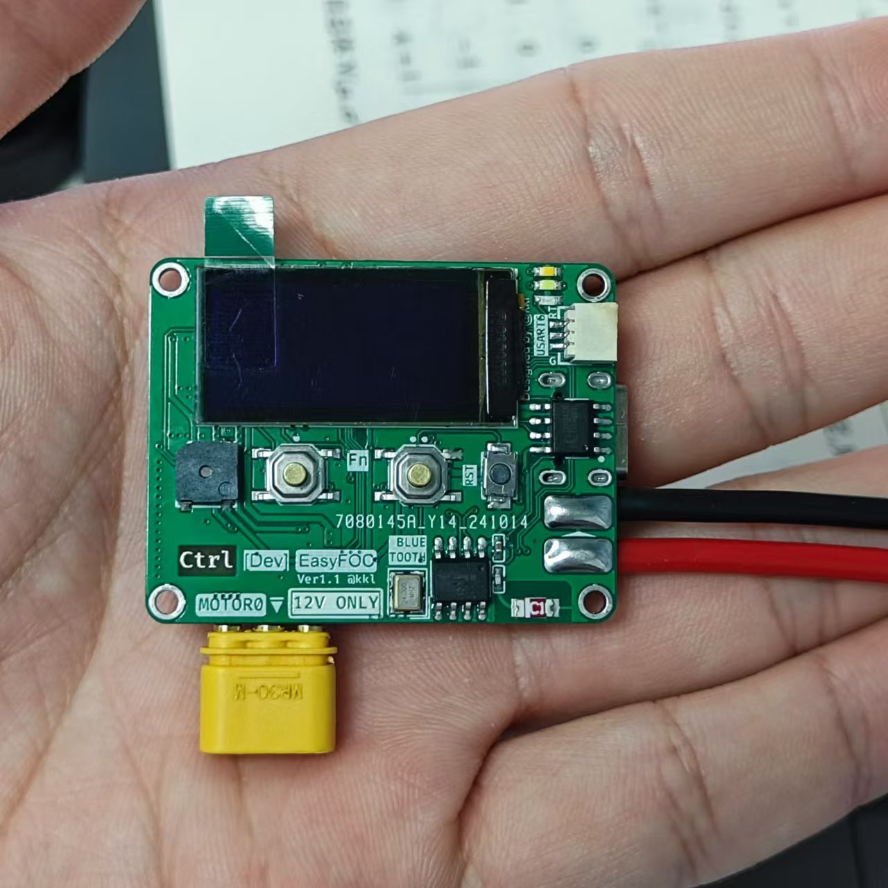
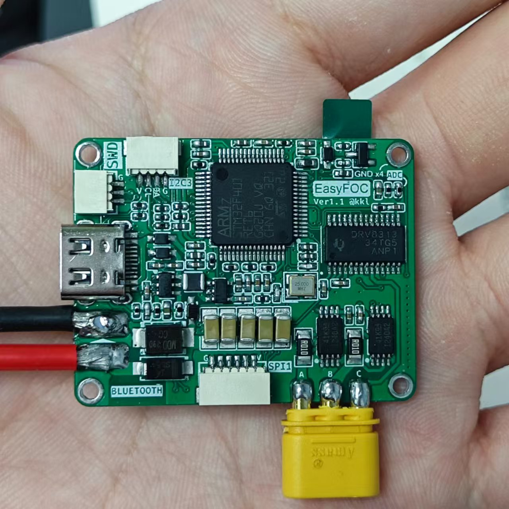
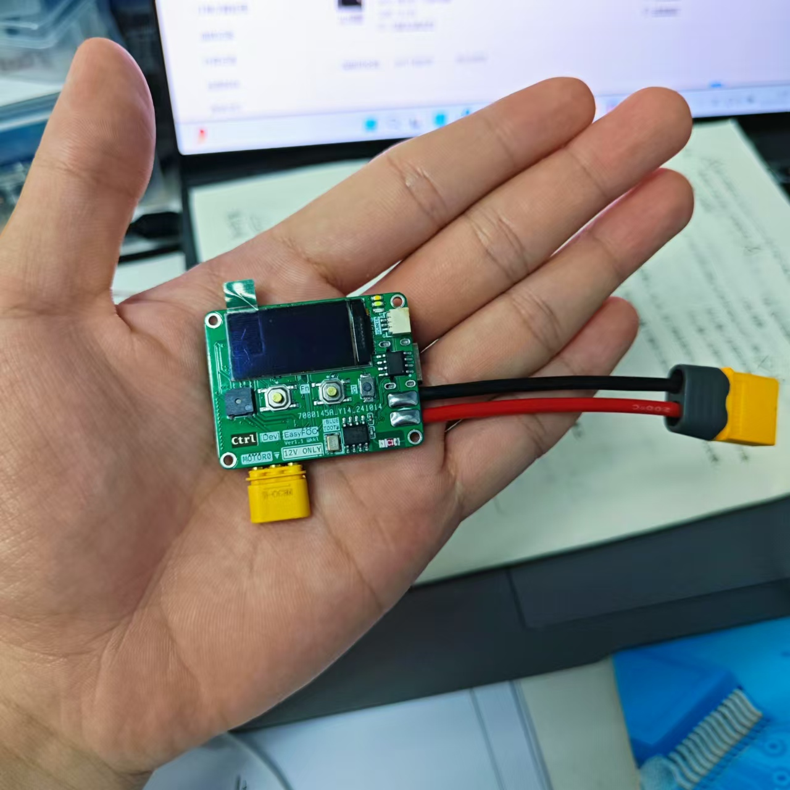
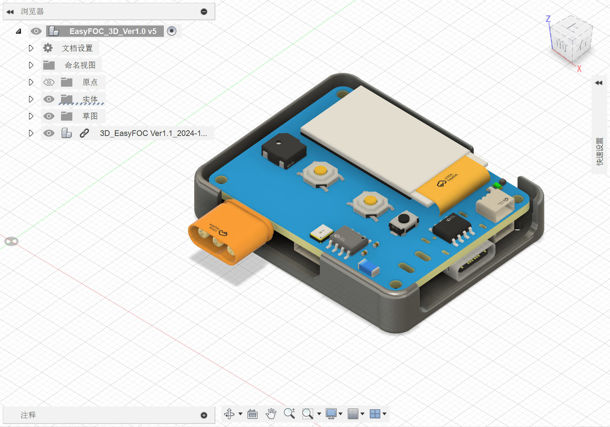

# EASY-FOC 丨 超迷你的FOC矢量控制器EasyFOC
### Author: kkl

> 本项目基于：**SimpleFOC** & **Ctrl-FOC-Lite**

---

图文演示：https://zhangkeliang0627.github.io/2024/12/27/基于STM32和SimpleFOC的EasyFOC矢量控制器/README/
硬件开源：https://oshwhub.com/hugego/easyfoc

## Snapshot









## 硬件配置
- 1. 主控：STM32F401RET6
- 2. 屏幕：SSD1312 Oled 0.96inch IIC接口 128x64分辨率
- 3. 电机驱动：DRV8313
- 4. 电流采样：INA240A2
- 5. 蓝牙通信：KT6368A
- 6. 串口通信：CH340N
- 7. 外壳：3D打印

## 功能

- 目前已经实现小功率无刷电机的位置、角度开闭环控制，适配了电流环的代码，可以正常运行。 
- 支持使用串口进行有线调试或者使用蓝牙进行无线调试。
- 支持3S航模锂电池接入（12.6V / XT60接口）.
- 板载Oled、两颗实体按钮以及蜂鸣器方便于人机交互。
- 引出一路IIC接口和一路SPI接口。
- 引出SWD烧录口，方便使用`ST-Link`or`DAP-Link`进行程序烧录。

## 串口指令集

调试走蓝牙 `KT6368A`（USART6），波特率 **115200 8N1**。每条命令以**换行\r\n**结尾。

> 格式约定：字母命令（`H`/`S`/`E`/`M`/`N`）的第二个字符必须**紧跟、无空格**（如 `EU`、`S1`、`MT`）；带参数的命令，参数紧跟命令字母（如 `T6.28`、`P0.5`）。

### 连接与读取

| 命令 | 功能 | 返回 |
|---|---|---|
| `H` | 链路测试 | `Hello World!` |
| `V` | 读实时速度 | `Vel=…`（rad/s） |
| `A` | 读绝对角度 | `Ang=…`（rad） |
| `C` | 读电流采样 | `rawA/rawB`、`ia/ib`、`θ`、`Id`、`Iq` |

### 编码器选择（会失能并重新初始化 FOC）

| 命令 | 编码器 | 极对数 |
|---|---|---|
| `S0` | AS5600（I2C） | 7 |
| `S1` | AS5047P（SPI） | 11 |

### 使能与运行模式

| 命令 | 功能 |
|---|---|
| `EU` | 使能（切速度模式、目标清零） |
| `ED` | 失能（目标清零） |
| `MA` | 角度闭环 |
| `MV` | 速度闭环 |
| `MT` | 力矩闭环 |

### 力矩控制方式

| 命令 | 方式 |
|---|---|
| `NV` | 电压模式（电流开环） |
| `NC` | DC current（电流闭环） |

### 目标值与 PID 参数

| 命令 | 参数 | 单位 |
|---|---|---|
| `T<x>` | 目标值 | 速度=rad/s；角度=rad；力矩=电压模式 V / 电流模式 A |
| `P<x>` | 速度环 P | — |
| `I<x>` | 速度环 I | — |
| `Q<x>` | 电流环 P | 欧姆 |
| `W<x>` | 电流环 I | 欧姆/秒 |

### 快速上手

上电默认：AS5047P、失能、电压模式、速度闭环。典型流程：

```
S1      # 选 AS5047P（默认已是，可跳过）
EU      # 使能
T5      # 设 5 rad/s 转起来
V       # 读速度
ED      # 失能停止
```

DC current 电流闭环：

```
NC      # 切电流闭环
EU      # 使能
MT      # 力矩模式
T0.1    # 设 0.1A 目标电流
C       # 读电流验证
ED      # 失能
```

> 注意：`EU` 会强制切回速度模式，力矩模式务必按 `EU → MT` 顺序执行。

## 鸣谢
- [@稚晖君](https://github.com/peng-zhihui)的项目[Ctrl-FOC-Lite](https://github.com/peng-zhihui/Ctrl-FOC-Lite)：为本项目提供了主要的硬件设计参考。
- 开源项目[SimpleFOC](https://github.com/simplefoc/Arduino-FOC)：为本项目提供了电机驱动算法。
