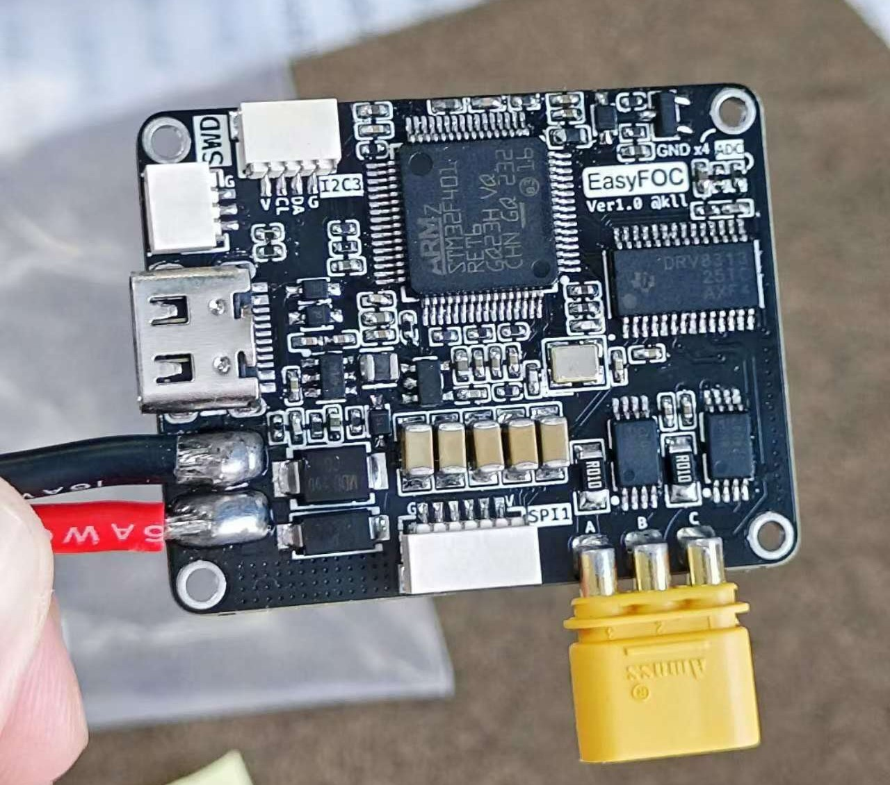
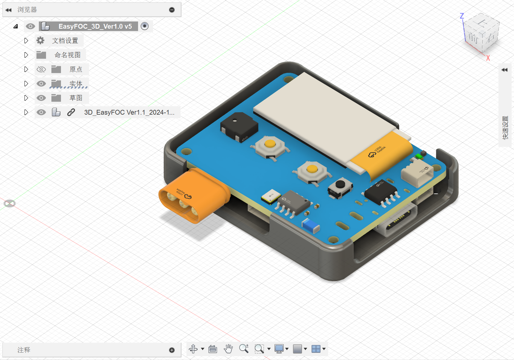

# EASY-FOC 丨 超迷你的FOC矢量控制器EasyFOC
### Author: kkl

> 本项目基于：**SimpleFOC** & **Ctrl-FOC-Lite**

---

## Snapshot

## 硬件配置
- 1. 主控：STM32F401RET6
- 2. 屏幕：SSD1312 Oled 0.96inch IIC接口 128x64分辨率
- 3. 电机驱动：DRV8313
- 4. 电流采样：INA240A2
- 5. 蓝牙通信：KT6368A
- 6. 串口通信：CH340N
- 7. 外壳：3D打印

## 功能

- 目前已经实现小功率无刷电机的位置、角度开闭环控制，适配了电流环的代码，可以正常运行。 
- 支持使用串口进行有线调试或者使用蓝牙进行无线调试。
- 支持3S航模锂电池接入（12.6V / XT60接口）.
- 板载Oled、两颗实体按钮以及蜂鸣器方便于人机交互。
- 引出一路IIC接口和一路SPI接口。
- 引出SWD烧录口，方便使用`ST-Link`or`DAP-Link`进行程序烧录。
